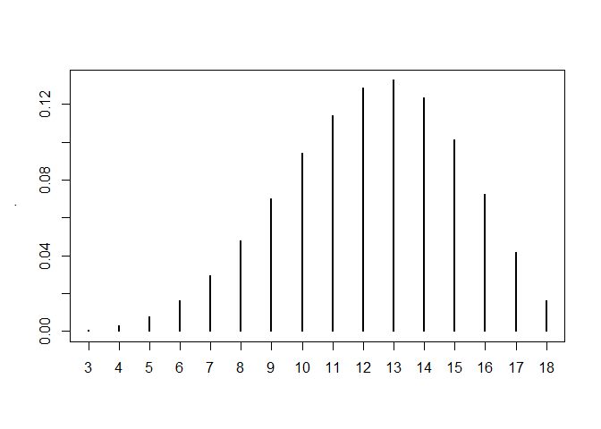

[](https://travis-ci.org/oganm/diceSyntax)
[](https://codecov.io/gh/oganm/diceSyntax)

# diceSyntax

``` r
roll('d6') # roll d6
```

    ## [1] "Rolls: [ *6* ] (d6)"

    ## [1] 6

``` r
roll('4d6') # roll 4d6
```

    ## [1] "Rolls: [ 3 2 4 2 ] (4d6)"

    ## [1] 11

``` r
roll('4d6k3') # roll 4d6 keep 3 highest
```

    ## [1] "Rolls: [ 5 3 *6* ] (4d6k3)"
    ## [1] "Dropped: [ 2 ]"

    ## [1] 14

``` r
roll('4d6kl3') # roll 4d6 keep lowest 3
```

    ## [1] "Rolls: [ 3 *6* 2 ] (4d6kl3)"
    ## [1] "Dropped: [ *6* ]"

    ## [1] 11

``` r
roll('4d6d1') # roll 4d6 drop 1 lowest
```

    ## [1] "Rolls: [ *6* *6* *1* ] (4d6d1)"
    ## [1] "Dropped: [ *1* ]"

    ## [1] 13

``` r
roll('4d6dh1') # roll 4d6 drop highest 1
```

    ## [1] "Rolls: [ 4 2 4 ] (4d6dh1)"
    ## [1] "Dropped: [ 4 ]"

    ## [1] 10

``` r
roll('4d6+3') # roll 4d6 add 3
```

    ## [1] "Rolls: [ 3 *1* *6* 5 ] (4d6)"

    ## [1] 18

``` r
roll('4d6r1r2') # roll 4d6 reroll 1s and 2s
```

    ## [1] "Rolls: [ *6* *6* 4 5 ] (4d6r1r2)"

    ## [1] 21

``` r
roll('4d6r<2') # same as above
```

    ## [1] "Rolls: [ *6* *6* 4 *6* ] (4d6r<2)"

    ## [1] 22

``` r
roll('4d6r1ro2') # roll 4d6 reroll 1s but reroll 2s only once
```

    ## [1] "Rolls: [ 3 5 4 5 ] (4d6r1ro2)"

    ## [1] 17

``` r
roll('5d2!') # exploding dice
```

    ## Called from: rollParam(rules$diceCount, rules$diceSide, rules$fate, rules$sort, 
    ##     rules$dropDice, rules$dropLowest, rules$add, rules[["reroll"]], 
    ##     rules$rerollOnce, rules$explode, rules$diceString, critMark, 
    ##     vocal, returnRolls)
    ## debug at D:/gitRepos/diceSyntax/R/diceBackground.R#188: dice = lapply(dice, function(x) {
    ##     manyRolls = c()
    ##     while (x == max(possibleDice)) {
    ##         manyRolls = c(manyRolls, x)
    ##         x = resample(possibleDice, 1)
    ##     }
    ##     x = c(manyRolls, x)
    ##     if (explode == 2) {
    ##         x = sum(x)
    ##     }
    ##     return(x)
    ## }) %>% unlist
    ## debug at D:/gitRepos/diceSyntax/R/diceBackground.R#202: if (!is.null(dropDice)) {
    ##     drop = dice[order(dice, decreasing = !dropLowest)[1:dropDice] %>% 
    ##         sort]
    ##     dice = dice[-order(dice, decreasing = !dropLowest)[1:dropDice] %>% 
    ##         sort]
    ## }
    ## debug at D:/gitRepos/diceSyntax/R/diceBackground.R#207: if (sort) {
    ##     dice = sort(dice)
    ##     if (!is.null(dropDice)) {
    ##         drop = sort(drop)
    ##     }
    ## }
    ## debug at D:/gitRepos/diceSyntax/R/diceBackground.R#213: result = sum(dice) + add
    ## debug at D:/gitRepos/diceSyntax/R/diceBackground.R#214: if (vocal & diceCount > 0) {
    ##     dicePrint = dice
    ##     dropPrint = drop
    ##     if (critMark) {
    ##         crits = dice %in% c(minValue, maxValue)
    ##         dicePrint[crits] = glue::glue("*{dice[crits]}*")
    ##     }
    ##     print(paste0("Rolls: [ ", paste(dicePrint, collapse = " "), 
    ##         " ] (", diceString, ")"))
    ##     if (!is.null(dropDice)) {
    ##         if (critMark) {
    ##             crits = drop %in% c(minValue, maxValue)
    ##             dropPrint[crits] = glue::glue("*{drop[crits]}*")
    ##         }
    ##         print(paste("Dropped: [", paste(dropPrint, collapse = " "), 
    ##             "]"))
    ##     }
    ## }
    ## debug at D:/gitRepos/diceSyntax/R/diceBackground.R#215: dicePrint = dice
    ## debug at D:/gitRepos/diceSyntax/R/diceBackground.R#216: dropPrint = drop
    ## debug at D:/gitRepos/diceSyntax/R/diceBackground.R#217: if (critMark) {
    ##     crits = dice %in% c(minValue, maxValue)
    ##     dicePrint[crits] = glue::glue("*{dice[crits]}*")
    ## }
    ## debug at D:/gitRepos/diceSyntax/R/diceBackground.R#218: crits = dice %in% c(minValue, maxValue)
    ## debug at D:/gitRepos/diceSyntax/R/diceBackground.R#219: dicePrint[crits] = glue::glue("*{dice[crits]}*")
    ## debug at D:/gitRepos/diceSyntax/R/diceBackground.R#221: print(paste0("Rolls: [ ", paste(dicePrint, collapse = " "), " ] (", 
    ##     diceString, ")"))
    ## [1] "Rolls: [ *1* *2* *1* *1* *2* *2* *1* *2* *1* ] (5d2!)"
    ## debug at D:/gitRepos/diceSyntax/R/diceBackground.R#222: if (!is.null(dropDice)) {
    ##     if (critMark) {
    ##         crits = drop %in% c(minValue, maxValue)
    ##         dropPrint[crits] = glue::glue("*{drop[crits]}*")
    ##     }
    ##     print(paste("Dropped: [", paste(dropPrint, collapse = " "), 
    ##         "]"))
    ## }
    ## debug at D:/gitRepos/diceSyntax/R/diceBackground.R#230: if (!returnRolls) {
    ##     return(result)
    ## } else {
    ##     if (is.null(dropDice)) {
    ##         drop = NULL
    ##     }
    ##     return(list(result = result, dice = dice, drop = drop))
    ## }
    ## debug at D:/gitRepos/diceSyntax/R/diceBackground.R#231: return(result)

    ## [1] 13

``` r
roll('5d2!!') # compounding dice
```

    ## Called from: rollParam(rules$diceCount, rules$diceSide, rules$fate, rules$sort, 
    ##     rules$dropDice, rules$dropLowest, rules$add, rules[["reroll"]], 
    ##     rules$rerollOnce, rules$explode, rules$diceString, critMark, 
    ##     vocal, returnRolls)
    ## debug at D:/gitRepos/diceSyntax/R/diceBackground.R#188: dice = lapply(dice, function(x) {
    ##     manyRolls = c()
    ##     while (x == max(possibleDice)) {
    ##         manyRolls = c(manyRolls, x)
    ##         x = resample(possibleDice, 1)
    ##     }
    ##     x = c(manyRolls, x)
    ##     if (explode == 2) {
    ##         x = sum(x)
    ##     }
    ##     return(x)
    ## }) %>% unlist
    ## debug at D:/gitRepos/diceSyntax/R/diceBackground.R#202: if (!is.null(dropDice)) {
    ##     drop = dice[order(dice, decreasing = !dropLowest)[1:dropDice] %>% 
    ##         sort]
    ##     dice = dice[-order(dice, decreasing = !dropLowest)[1:dropDice] %>% 
    ##         sort]
    ## }
    ## debug at D:/gitRepos/diceSyntax/R/diceBackground.R#207: if (sort) {
    ##     dice = sort(dice)
    ##     if (!is.null(dropDice)) {
    ##         drop = sort(drop)
    ##     }
    ## }
    ## debug at D:/gitRepos/diceSyntax/R/diceBackground.R#213: result = sum(dice) + add
    ## debug at D:/gitRepos/diceSyntax/R/diceBackground.R#214: if (vocal & diceCount > 0) {
    ##     dicePrint = dice
    ##     dropPrint = drop
    ##     if (critMark) {
    ##         crits = dice %in% c(minValue, maxValue)
    ##         dicePrint[crits] = glue::glue("*{dice[crits]}*")
    ##     }
    ##     print(paste0("Rolls: [ ", paste(dicePrint, collapse = " "), 
    ##         " ] (", diceString, ")"))
    ##     if (!is.null(dropDice)) {
    ##         if (critMark) {
    ##             crits = drop %in% c(minValue, maxValue)
    ##             dropPrint[crits] = glue::glue("*{drop[crits]}*")
    ##         }
    ##         print(paste("Dropped: [", paste(dropPrint, collapse = " "), 
    ##             "]"))
    ##     }
    ## }
    ## debug at D:/gitRepos/diceSyntax/R/diceBackground.R#215: dicePrint = dice
    ## debug at D:/gitRepos/diceSyntax/R/diceBackground.R#216: dropPrint = drop
    ## debug at D:/gitRepos/diceSyntax/R/diceBackground.R#217: if (critMark) {
    ##     crits = dice %in% c(minValue, maxValue)
    ##     dicePrint[crits] = glue::glue("*{dice[crits]}*")
    ## }
    ## debug at D:/gitRepos/diceSyntax/R/diceBackground.R#218: crits = dice %in% c(minValue, maxValue)
    ## debug at D:/gitRepos/diceSyntax/R/diceBackground.R#219: dicePrint[crits] = glue::glue("*{dice[crits]}*")
    ## debug at D:/gitRepos/diceSyntax/R/diceBackground.R#221: print(paste0("Rolls: [ ", paste(dicePrint, collapse = " "), " ] (", 
    ##     diceString, ")"))
    ## [1] "Rolls: [ *1* *1* *1* *1* *1* ] (5d2!!)"
    ## debug at D:/gitRepos/diceSyntax/R/diceBackground.R#222: if (!is.null(dropDice)) {
    ##     if (critMark) {
    ##         crits = drop %in% c(minValue, maxValue)
    ##         dropPrint[crits] = glue::glue("*{drop[crits]}*")
    ##     }
    ##     print(paste("Dropped: [", paste(dropPrint, collapse = " "), 
    ##         "]"))
    ## }
    ## debug at D:/gitRepos/diceSyntax/R/diceBackground.R#230: if (!returnRolls) {
    ##     return(result)
    ## } else {
    ##     if (is.null(dropDice)) {
    ##         drop = NULL
    ##     }
    ##     return(list(result = result, dice = dice, drop = drop))
    ## }
    ## debug at D:/gitRepos/diceSyntax/R/diceBackground.R#231: return(result)

    ## [1] 5

``` r
roll('6d6+4d4-3d5') # multiple rolls
```

    ## [1] "Rolls: [ 5 2 2 3 3 5 ] (6d6)"
    ## [1] "Rolls: [ 3 3 *1* 2 ] (4d4)"
    ## [1] "Rolls: [ 3 *1* 3 ] (3d5)"

    ## [1] 22

``` r
r('1d6') # shortcut function
```

    ## [1] "Rolls: [ 4 ] (1d6)"

    ## [1] 4

Other variables that `roll` funciton accepts are

  - `critMark`: `TRUE` by default. If `TRUE` it adds stars around the
    dice roll in printed output if it is max or min value for the dice
  - `vocal`: `TRUE` by default. If `FALSE` disables printing of dice
    rolls
  - `returnRolls`: `FALSE` by default. If `TRUE` returns a list instead
    of an integer that includes rolled and dropped dice along with the
    dice sum

<!-- end list -->

``` r
r("10d10dl3",returnRolls = TRUE, vocal = FALSE)
```

    ## $`10d10dl3`
    ## $`10d10dl3`$result
    ## [1] 54
    ## 
    ## $`10d10dl3`$dice
    ## [1]  6  7 10  7 10  7  7
    ## 
    ## $`10d10dl3`$drop
    ## [1] 2 3 3
    ## 
    ## 
    ## $result
    ## [1] 54

## Dice stats

Probabilities of outcomes can be calculated with `diceProb` function

``` r
diceProb('4d6d1') %>% plot(names(.) %>% as.numeric(),.)
```

<!-- -->
