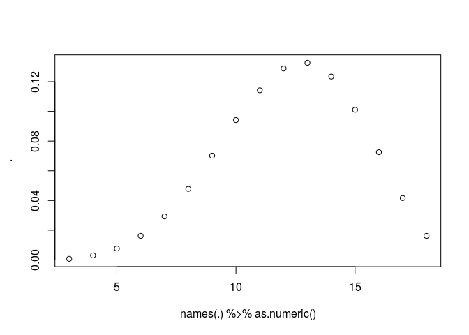

[](https://travis-ci.org/oganm/diceSyntax) [](https://codecov.io/gh/oganm/diceSyntax)

diceSyntax
==========

``` r
roll('4d6') # roll 4d6
```

    ## [1] "Rolls: [ 5 *6* 5 *6* ]"

    ## [1] 22

``` r
roll('4d6k3') # roll 4d6 keep 3 highest
```

    ## [1] "Rolls: [ 3 2 4 ]"
    ## [1] "Dropped: [ *1* ]"

    ## [1] 9

``` r
roll('4d6kl3') # roll 4d6 keep lowest 3
```

    ## [1] "Rolls: [ 5 *1* *1* ]"
    ## [1] "Dropped: [ *6* ]"

    ## [1] 7

``` r
roll('4d6d1') # roll 4d6 drop 1 lowest
```

    ## [1] "Rolls: [ 5 3 3 ]"
    ## [1] "Dropped: [ *1* ]"

    ## [1] 11

``` r
roll('4d6dh1') # roll 4d6 drop highest 1
```

    ## [1] "Rolls: [ 3 3 2 ]"
    ## [1] "Dropped: [ *6* ]"

    ## [1] 8

``` r
roll('4d6+3') # roll 4d6 add 3
```

    ## [1] "Rolls: [ 3 2 *6* 5 ]"

    ## [1] 19

``` r
roll('4d6r1r2') # roll 4d6 reroll 1s and 2s
```

    ## [1] "Rolls: [ 5 4 5 5 ]"

    ## [1] 19

``` r
roll('4d6r<2') # same as above
```

    ## [1] "Rolls: [ *3* 4 *6* *3* ]"

    ## [1] 16

``` r
roll('4d6r1ro2') # roll 4d6 reroll 1s but reroll 2s only once
```

    ## [1] "Rolls: [ *6* 5 3 3 ]"

    ## [1] 17

``` r
roll('5d2!') # exploding dice
```

    ## [1] "Rolls: [ *2* *2* *2* *1* *2* *1* *1* *2* *1* *1* ]"

    ## [1] 15

``` r
roll('5d2!!') # compounding dice
```

    ## [1] "Rolls: [ *1* *1* 3 3 5 ]"

    ## [1] 13

``` r
r('1d6') # shortcut function
```

    ## [1] "Rolls: [ 5 ]"

    ## [1] 5

``` r
r(r1d6) # non standard evaluation
```

    ## [1] "Rolls: [ *1* ]"

    ## [1] 1

While `roll` and `r` allows non standard evaluation, variable names for character values can be used as long as they don't match the following regex: `^r[0-9]+d[0-9]+` or the variable name will be interpreted as a dice roll.

``` r
myRoll = '10d10'
r4d6 = '10d10'

r(myRoll)
```

    ## [1] "Rolls: [ 5 3 8 3 *10* 8 *10* 3 *10* 2 ]"

    ## [1] 62

``` r
r(r4d6)
```

    ## [1] "Rolls: [ 4 *6* 5 4 ]"

    ## [1] 19

Other variables that `roll` funciton accepts are

-   `critMark`: `TRUE` by default. If `TRUE` it adds stars around the dice roll in printed output if it is max or min value for the dice
-   `vocal`: `TRUE` by default. If `FALSE` disables printing of dice rolls
-   `returnRolls`: `FALSE` by default. If `TRUE` returns a list instead of an integer that includes rolled and dropped dice along with the dice sum

``` r
r(r10d10dl3,returnRolls = TRUE, vocal = FALSE)
```

    ## $result
    ## [1] 49
    ## 
    ## $dice
    ## [1]  4  7 10  7  6  9  6
    ## 
    ## $drop
    ## [1] 4 1 2

Dice stats
----------

Probabilities of outcomes can be calculated with `diceProb` function

``` r
diceProb('4d6d1') %>% plot(names(.) %>% as.numeric(),.)
```


